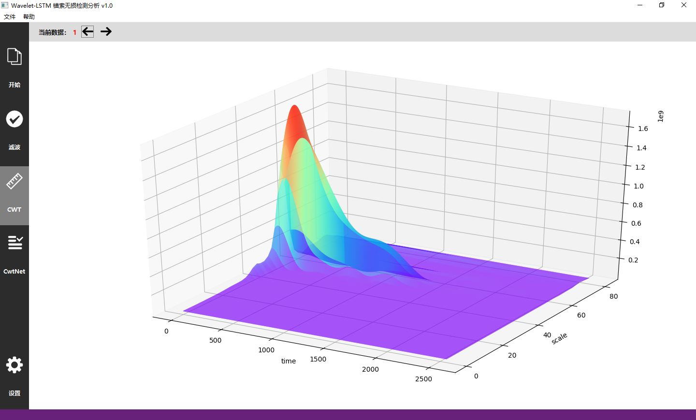
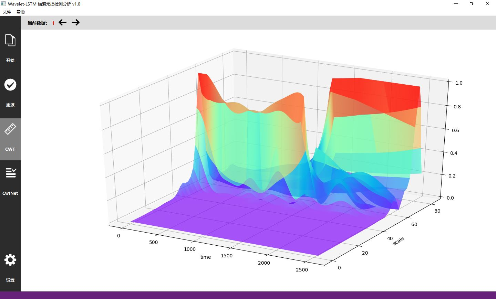
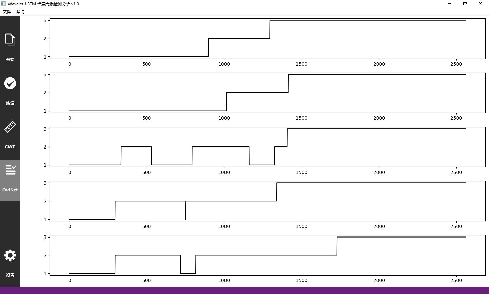

**Tip**:  This page can be translated by *Chrome Google Translate*

**提示**: 本页面支持Chrome Google翻译

***

# Wavelet_LSTM
本项目将**深度学习**与**数字信号处理**算法相结合，通过**LSTMs（RNN）**与**连续小波变换CWT**的松耦合提出CwtNet(连续小波长度时记忆网络)，实现了对结构健康体系的无损检测分析。欢迎大家提出宝贵的意见。

# 简介

本项目基于长短期记忆网络LSTMs、小波分析Wavelet进行理论创新，设计并实现软件系统，实现对锚索智能化的无损检测分析。该项目主要工作为以下两个方面：
>**(1)理论研究：**基于深度学习与信号处理理论，对小波分析Wavelet与长短期记忆网络LSTMs进行松散型结合，并提出“连续小波变换长短期记忆网络CwtNet”：①实现对复杂非平稳信号(锚索无损检测数据)有效的处理与识别分析，为该类信号的处理分析提供了一种新的解决方案；②实现了对信号的智能检测分析，避免了人为经验的结果分析识别，简化了传统的处理过程及人为经验的参数调试；③借助小波分析局部化时频分析能力，实现了深度学习对信号进行高数值精度的计算和识别分析。

>**(2)系统实现：**基于“三层架构 + MVC模式”设计软件系统的框架，集成信号处理、深度学习、TensorFlow人工智能及深度学习开发系统、图形界面程等内容。①系统通过CwtNet算法实现对锚索无损检测数据的智能化检测分析，避免了人为经验的特征结果识别，简化了分析流程和参数调整过程。②系统通过Python编程实现，基于Google的TensorFlow人工智能及深度学习开源软件库实现LSTMs的定义与开发；基于Qt(PyQt)图形用户界面GUI框架实现图形界面程序；对于多种图形绘制任务，系统基于Matplotlib、PyQt设计实现2D、3D绘图控件并完成图形绘制。

# 简介

## 1.软件系统界面展示：

### 原始数据

### 连续小波变换CWT

### 时频特征分析

### CwtNet特征曲线

### 软件系统架构

